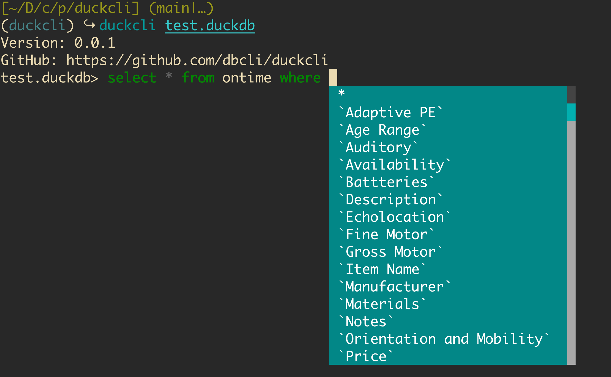

# duckcli

A command-line client for DuckDB databases that has auto-completion and syntax highlighting.



## Installation

You can install it via pip:

```
$ pip install -U duckcli
```

## Usage

```
$ duckcli --help

Usage: duckcli [OPTIONS] [DATABASE]

Examples:
  - duckcli duckdb_filename
```

A config file is automatically created at `~/.config/duckcli/config` at first launch. For Windows machines a config file is created at `~\AppData\Local\dbcli\duckcli\config` at first launch. See the file itself for a description of all available options.
